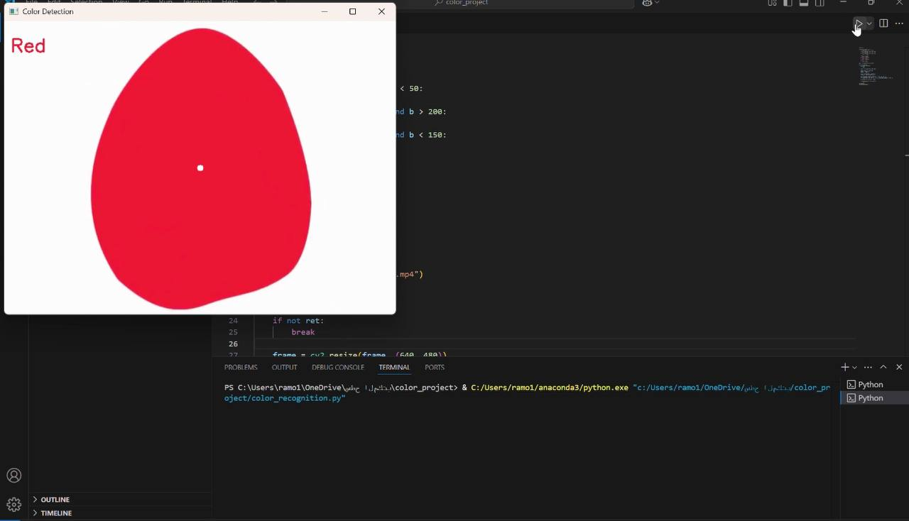

# 🎨 Color Recognition Using OpenCV

## 📌 Project Description

This project demonstrates color recognition using OpenCV in Python.

Instead of using a live webcam, we used a pre-recorded video file (`colors.mp4`) that contains various colors.  
The program detects the color at the center of each video frame, and displays the color name (like Red, Green, Blue, etc.) on the screen.

This project was completed as part of the Smart Methods internship.

---

## 📁 Project Structure

| File Name            | Description                                 |
|---------------------|---------------------------------------------|
| color_recognition.py | Python file containing the main OpenCV code |
| colors.mp4         | The test video file                         |
| README.md          | This documentation file                     |
| screenshot.png     | Screenshot showing output of color detection |

---

## 🚀 How to Use the Program

### 1️⃣ Install Required Library

If you don't have OpenCV installed, run:
pip install opencv-python

### 2️⃣ Run the Program

Make sure the video file (`colors.mp4`) is in the same folder as the Python file.  
Then run the program using:
python color_recognition.py

### 3️⃣ How It Works

- The video will open and play frame by frame.
- The program reads the center pixel of each frame.
- Based on the BGR values, it matches the color to a known name.
- The name of the detected color will appear at the top of the video.
- Press Q to exit the video window.

---

## 💡 Color Detection Logic

The color is classified using the following logic:
def get_color_name(b, g, r):
    if r > 200 and g < 100 and b < 100:
        return "Red"
    elif g > 200 and r < 100 and b < 100:
        return "Green"
    elif b > 200 and r < 100 and g < 100:
        return "Blue"
    elif r > 200 and g > 200 and b < 100:
        return "Yellow"
    elif r > 200 and g > 200 and b > 200:
        return "White"
    elif r < 50 and g < 50 and b < 50:
        return "Black"
    else:
        return "Other"

You can improve the accuracy by using color distance metrics or external color datasets.

---

## 🖼️ Example Output

Below is an example output showing the detected color name:

The program shows the detected color name at the top of the video and highlights the detection point with a small circle at the center.

---

## 👩‍💻 Developed by

Renad amin faydh  
Smart Methods Internship 2025  

